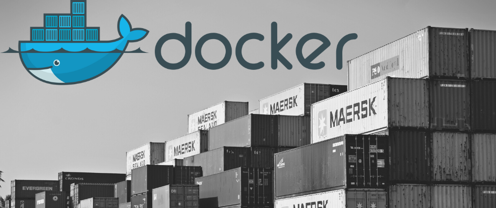

# [Laboratório GTi](https://github.com/systemboys/GTi_Laboratory#laborat%C3%B3rio-gti "Laboratório GTi") / Entendendo Docker

- [Mundo Docker (Cristiano Diedrich)](# "Mundo Docker (Cristiano Diedrich)")

---

## Mundo Docker (Cristiano Diedrich)

Olá pessoal!

Para você que está começando a ler nossos posts agora, sugiro que leia antes esse e esse link que explicam o que é o Docker e como ele funciona. Hoje nós abordaremos um dos assuntos mais importantes dentro do Docker: O Filesystem.

O sistema de arquivos do Docker é chamado de layered, ou seja, é um sistema de arquivo em camadas, o que isso quer dizer?

Um sistema de arquivo comum, possui basicamente duas camadas:

bootfs: Onde ficam o sistema de Boot do sistema e o Kernel.

rootfs: Inclui o sistema de arquivo do sistema, incluindo a arquitetura de diretório, em sistemas unix-like: /dev, /proc, /bin, /etc, /lib, /usr, e /tmp assim como os arquivos de configuração e binários do sistema.

Quando o sistema é iniciado ele carrega o rootfs primeiramente em modo somente leitura, verifica sua integridade e em seguida remonta-o como leitura/escrita e assim fica disponível para o usuário/aplicação.

No Docker temos essa arquitetura também, mas com um diferencial, a camada de escrita que o processo/aplicação visualiza não é o mesmo rootfs base, e sim uma camada de abstração do rootfs, isso é o que faz com que um container torne-se portável, pois as modificações realizadas não são aplicadas ao sistema origem do container, e sim na camada a qual o sistema visualiza.

Para ficar mais claro, veja na figura abaixo como é um sistema tradicional:

 

Agora veja como é o filesystem no docker:

 

Como podem notar o bootfs em vez de ser único por sistema/container, é compartilhado entre eles, mas o rootfs é isolado por camadas, ou seja, o que deve ser em comum entre o host e container é compartilhado via AUFS, que monta uma camada de leitura/escrita em cima do filesystem em somente leitura, isso garante que modificações feitas dentro do container não afetem o sistema de arquivos do host.

A imagem abaixo ilustra melhor como funciona essas camadas:

Um detalhe nessa arquitetura é que a cada modificação e commit do container é gerada uma nova camada, ou seja, digamos que eu inicie um container a partir de uma imagem do Debian, e instale o serviço apache dentro desse container, quando eu for transformar esse container em uma imagem, essa imagem possuirá a primeira camada que é do sistema Debian, e uma camada adicional que refere-se a instalação do serviço apache. Na imagen abaixo podemos visualizar melhor esse ambiente.

Lembrando que uma imagem pode ser utilizada diversas vezes, ou seja, há compartilhamento da imagem entre os containers, mas os containers depois de iniciados são isolados uns dos outros, na imagem abaixo podemos visualizar essa arquitetura.

Como podemos notar, há o compartilhamento das camadas inferiores, pois elas fazem parte da imagem que originou o container, e a camada de escrita, que faz parte do container rodando, é isolada para cada container.

Por hoje é isso, veremos em breve um pouco mais sobre filesystem no Docker, e algumas outras questões relacionadas a essa arquitetura. Ficou com dúvida? Gostaria de saber mais? Algum feedback a nos dar? Deixe sua mensagem e vamos conversando.

Abraço!

Cristiano Diedrich

Entusiasta Open Source, seu principal foco é ir atrás de ideias novas e torna-las realidade através de soluções simples e eficientes, o menos é mais, e o dividir é multiplicar.

[(&larr;) Voltar](https://github.com/systemboys/GTi_Laboratory#laborat%C3%B3rio-gti "Voltar ao Sumário") | 
[(&uarr;) Subir](#assunto "Subir para o topo")

---